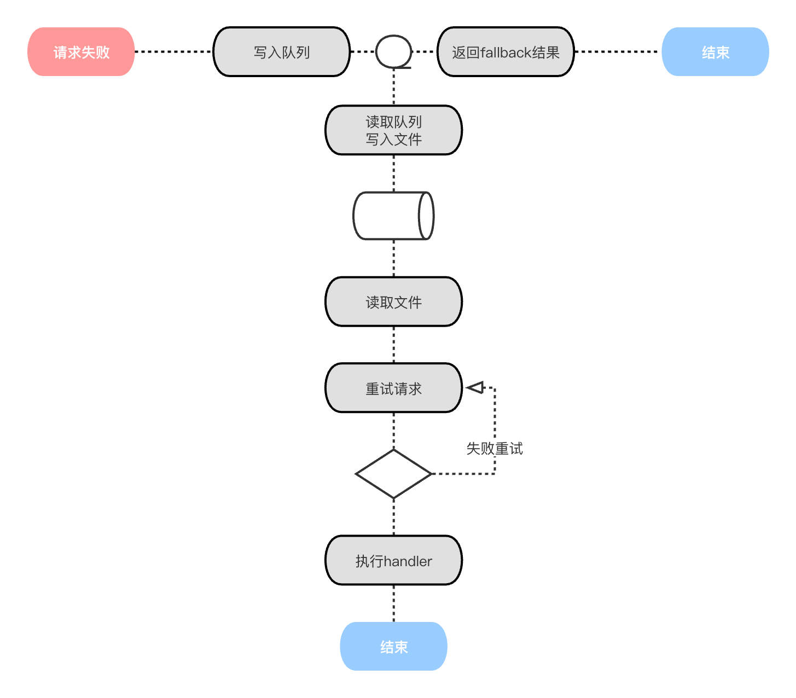

#### 简介

---

在易盾内容安全sdk中，为了保证核心接口的可用性，特别针对检测接口，为接入方默认提供了基于文件的恢复策略。
即：如果执行检测请求失败后，默认将失败请求写入到文件中，并向上层返回指定的fallback结果，同时进行异步重试，直到请求成功。

#### 实现原理

---

提交检测的接口请求失败后，会将失败的请求写入到内存的失败队列，同时文件写入线程会从失败队列中不停轮询并将失败的请求以json的形式写入到失败文件中。
恢复线程则不停轮询失败文件，当获取到新的失败请求时，则发起请求进行重试，直到成功后再调用接入方指定的handler，执行接入方的业务逻辑。
而如果重试请求一直失败，并达到一定次数后，则放入error文件，间隔一段时间后再重试一次。



#### 开启步骤

---

故障恢复的功能默认是关闭的，如果需要开启，则需要下面的代码声明。

1. 首先需要创建一个文件恢复的执行器，注意：这个对象是全局单例的

```
    RecoverConfig recoverConfig = new RecoverConfig();
    recoverConfig.setRecoverFileDir("恢复文件所在的目录");
    DefaultRequestRecover requestRecover = DefaultRequestRecover.createRecover(recoverConfig);
```

2. 注册请求失败的接口在异步重试成功后，执行的handler，每个接口对应一个自己的handler，注意：只有设置了handler的接口才会开启故障恢复，
   如果多个接口都需要开启故障恢复，则需要注册多个handler，handler中的泛型类型，则为对应接口的返回对象

```
  requestRecover.registerRecoverHandler(new AbstractRequestRecoverHandler<ImageV5CheckResponse>() {
      @Override
      public void handle(ImageV5CheckResponse response) {
          // 请求异步恢复成功后，处理请求结果
      }
  });
```

3. 注册请求失败的接口的fallback结果，即：开启了故障恢复的接口请求失败时，返回的默认值，没有注册的接口，默认返回code为200的fallback结果

```
  ImageV5CheckResponse fallbackResp = new ImageV5CheckResponse();
  fallbackResp.setCode(100);
  fallbackResp.setMsg("fallback response");

  requestRecover.registerFallback(fallbackResp);
```

4. 最后在需要开启故障恢复的clientProfile中指定请求恢复器。

```
  ClientProfile clientProfile = AntispamRequester.createDefaultProfile("SecretId", "SecretKey");
  // 指定故障恢复的recover
  clientProfile.setRequestRecover(requestRecover);
```

#### 参数说明


| 名称 | 含义                                                                                                                          | 默认值 |
| ---- | ----------------------------------------------------------------------------------------------------------------------------- | ------ |
|      | 统计时间窗口范围。单位：毫秒                                                                                                  | 10分钟 |
|      | 触发熔断的错误率（百分比）。如：40表示在单个统计时间窗口内，若错误次数达到总次数的40%，则会触发熔断，将目标域名标记为不可用。 | 40     |
|      | 触发熔断需满足的最低请求总数。在单个统计时间窗口内，只有请求总数大于此值，熔断策略才会生效。                                  | 50     |
|      | 单次熔断的持续时间。单位：毫秒。超过持续时间后，域名会被尝试请求是否可用。                                                    | 20分钟 |
