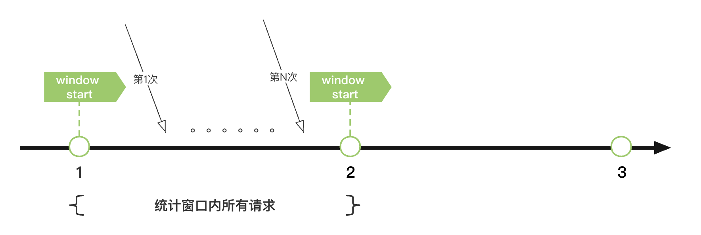

#### 简介

---

在易盾内容安全sdk中，针对不同的业务，例如：文本、图片、音视频等，分别提供了不同的region支持，以使客户能够选择合理的region，并得到最好的请求响应时间。而每个region内，为了保证请求的高可用性，我们提供了多个endpoint，并提供了对应的熔断降级能力，以尽可能使请求得到最终的处理。

#### 实现原理

---

在请求的client里我们维护了一个endpoint的熔断器，在每个请求真正执行之前，我们会通过这个endpoint熔断器去获取最终请求的endpoint。根据指定的region获取到可用的endpoint列表后，再根据每个endpoint请求的统计情况计算对应的熔断情况，选择可用的endpoint作为最终的请求地址。如果每个endpoint都不可用时，默认选择第一个。

sdk底层选择了固定窗口作为熔断器的默认统计实现，即：根据窗口内的统计情况计算熔断情况。

#### 参数说明

| 名称                                    | 含义                                                                | 默认值  |
|---------------------------------------|-------------------------------------------------------------------|------|
| statWindowMillis                      | 统计时间窗口范围。单位：毫秒                                                    | 10分钟 |
| circuitBreakerFailThresholdPercentage | 触发熔断的错误率（百分比）。如：40表示在单个统计时间窗口内，若错误次数达到总次数的40%，则会触发熔断，将目标域名标记为不可用。 | 40   |
| circuitBreakerRequestVolumeThreshold  | 触发熔断需满足的最低请求总数。在单个统计时间窗口内，只有请求总数大于此值，熔断策略才会生效。| 50   |
| circuitBreakerSleepWindowMillis | 单次熔断的持续时间。单位：毫秒。超过持续时间后，域名会被尝试请求是否可用。 | 20分钟 |
